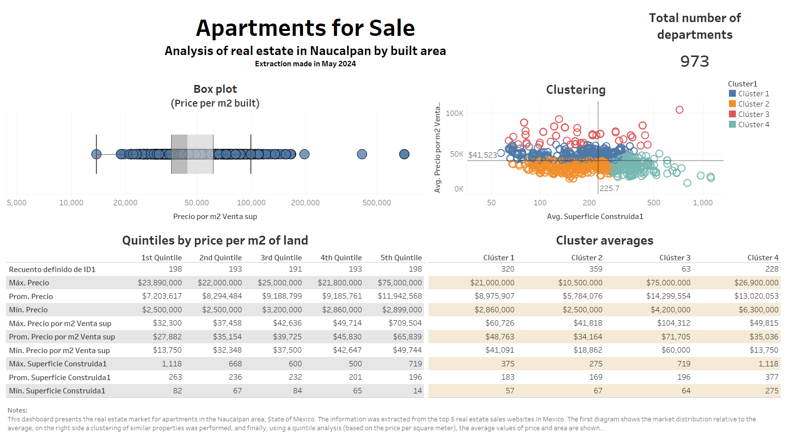

# Data Visualization and Data Mining 

## :bar_chart: **Municipal Success Rating of the Restaurant Industry**
This project presents dashboards generated from a model predicting the success of businesses at the national and state levels. The model is based on governmental data from sources like INEGI, DENUE, and GOB, weighting various variables to assign a percentage rating to each municipality. Examples of variables include: TPV transactions per 10,000 adults, number of ATMs, schools, banks, etc. Feature engineering and clustering techniques were used to refine the rating process.

**National Overview:**

**State Example: Querétaro**

## :houses: **Real Estate Market**
This section presents dashboards that highlight trends in the real estate market, using data from the top 5 real estate websites. The analysis includes quintiles, clustering, and geolocation of properties. The examples shown correspond to an analysis of apartments for sale in Naucalpan, State of Mexico.

**Clustering and Quintile Analysis:**

**Property Details by Cluster:**

**Geolocation and Comparison of Urban Containment Perimeters:**

## :computer: **Webscraping**
This section includes code examples used for information extraction in two cases: a directory of supermarket stores and a webpage scraped for real estate market analysis. The codes are located in the corresponding folder. It is important to note that the functionality of the code may vary depending on updates to the HTML elements in the webpage’s source code.
